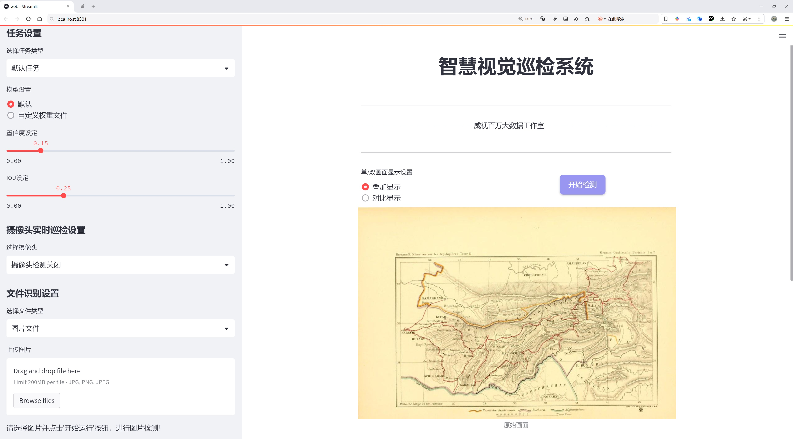
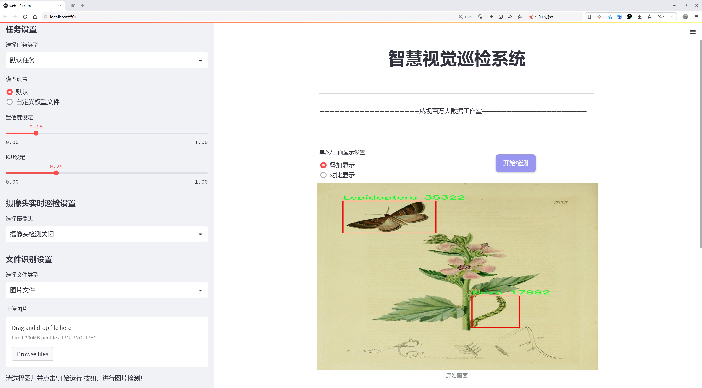
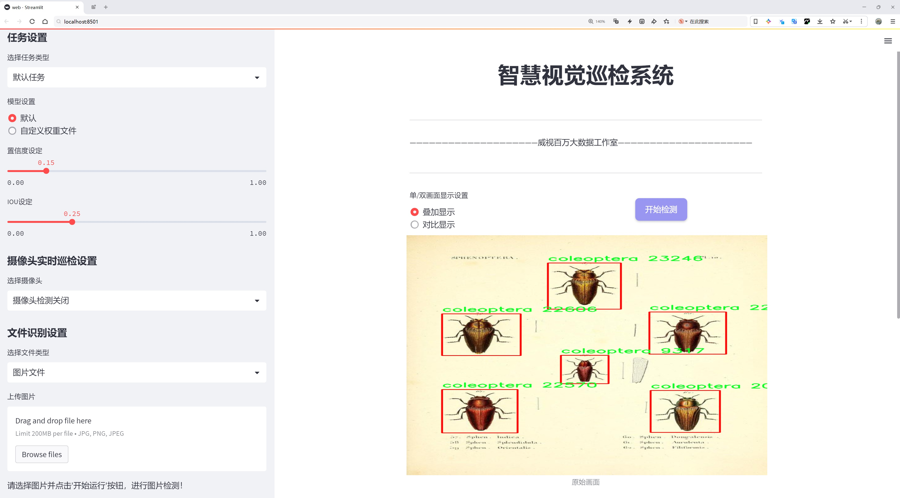
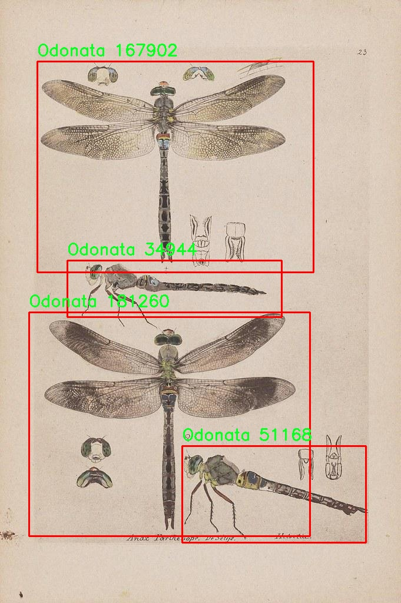
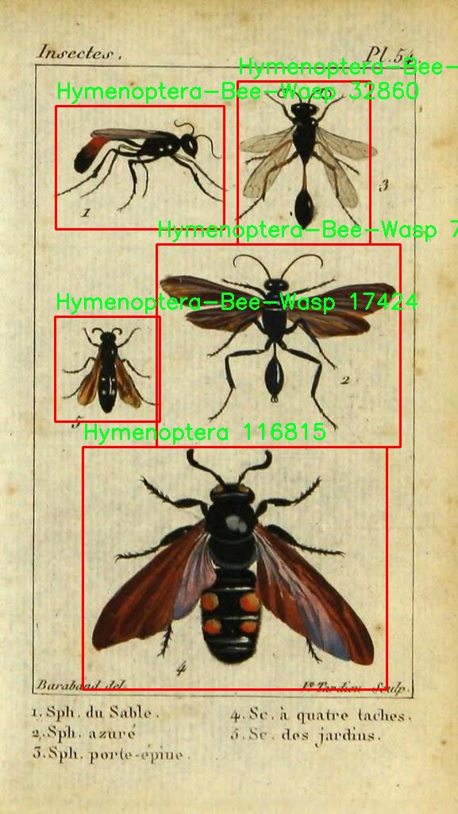
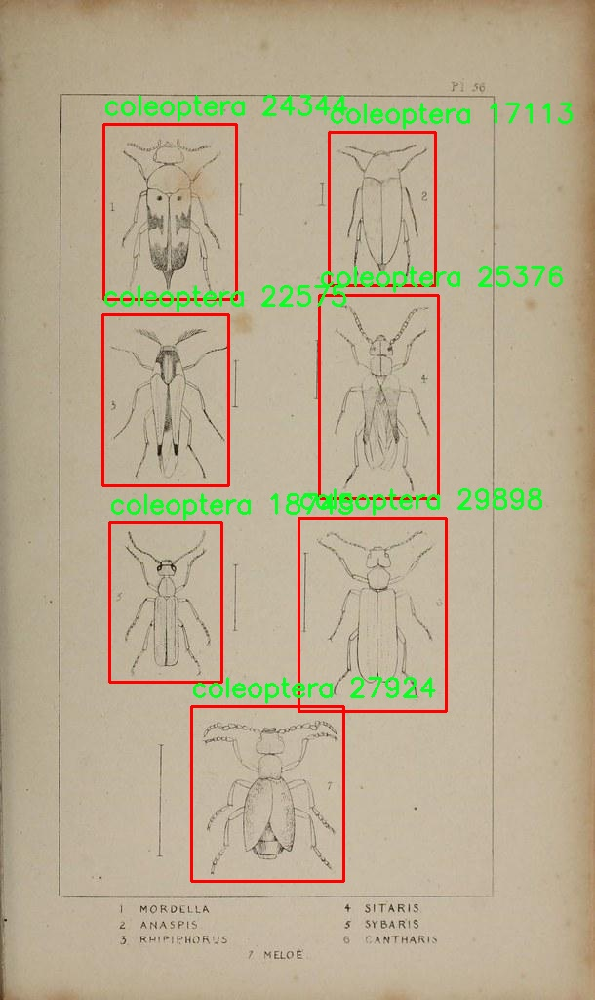
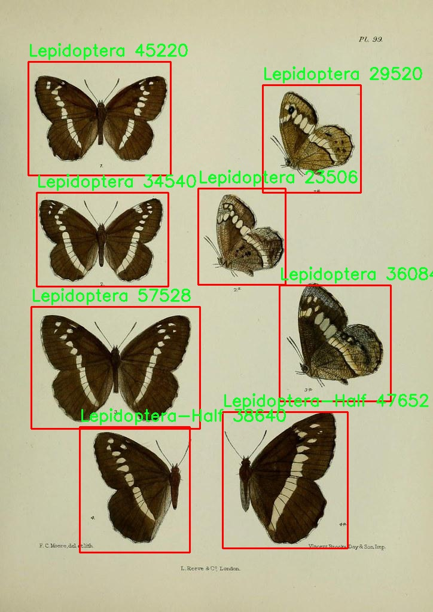
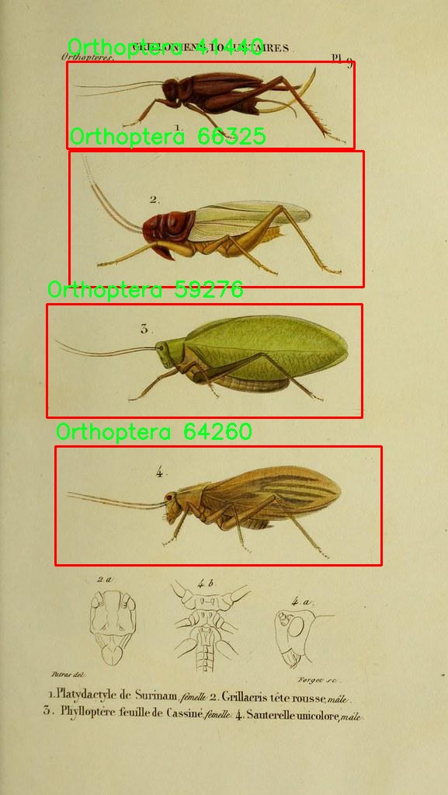

# 昆虫分类与检测系统源码分享
 # [一条龙教学YOLOV8标注好的数据集一键训练_70+全套改进创新点发刊_Web前端展示]

### 1.研究背景与意义

项目参考[AAAI Association for the Advancement of Artificial Intelligence](https://gitee.com/qunmasj/projects)

项目来源[AACV Association for the Advancement of Computer Vision](https://kdocs.cn/l/cszuIiCKVNis)

研究背景与意义

昆虫是地球上最为丰富多样的生物群体之一，已知的昆虫种类超过一百万种，且每年仍有大量新种被发现。昆虫在生态系统中扮演着至关重要的角色，涉及授粉、分解、食物链等多个方面。随着全球气候变化和人类活动的加剧，昆虫的栖息地受到严重威胁，导致许多物种的数量急剧下降。因此，昆虫的分类与检测不仅对生物多样性保护具有重要意义，也为生态研究、农业生产及公共卫生等领域提供了重要的科学依据。

传统的昆虫分类方法主要依赖于专家的人工识别，这种方法不仅耗时耗力，而且受限于专家的知识和经验，难以应对昆虫种类繁多的挑战。近年来，计算机视觉技术的快速发展为昆虫分类提供了新的解决方案。基于深度学习的目标检测模型，尤其是YOLO（You Only Look Once）系列，因其高效的实时检测能力和较高的准确性，逐渐成为昆虫分类研究中的重要工具。

本研究旨在基于改进的YOLOv8模型，构建一个高效的昆虫分类与检测系统。YOLOv8作为YOLO系列的最新版本，结合了多种先进的深度学习技术，能够在保持高精度的同时，显著提高检测速度。通过对昆虫图像数据集的训练与优化，该系统将能够自动识别和分类多达30个不同的昆虫类群，包括Arachnida、Blattodea、Hymenoptera等。这一系统的建立，不仅能够大幅提高昆虫分类的效率，还将为昆虫生态学研究提供强有力的技术支持。

在数据集方面，本研究使用的“Bug Gan”数据集包含632张昆虫图像，涵盖了30个不同的类群。这一数据集的多样性和丰富性为模型的训练提供了良好的基础，使得系统能够在多种环境和条件下进行有效的分类与检测。此外，数据集中包括了不同生命周期阶段的昆虫（如幼虫、蛹等），这将有助于模型学习不同形态特征，从而提高分类的准确性。

综上所述，基于改进YOLOv8的昆虫分类与检测系统的研究，不仅具有重要的学术价值，也对生态保护、农业管理和生物多样性监测等实际应用具有深远的意义。通过自动化的昆虫分类与检测技术，我们能够更好地监测和保护昆虫种群，促进生态环境的可持续发展。随着技术的不断进步，未来该系统还可以扩展到其他生物种类的检测与分类，为生物多样性保护提供更为广泛的支持。

### 2.图片演示







##### 注意：由于此博客编辑较早，上面“2.图片演示”和“3.视频演示”展示的系统图片或者视频可能为老版本，新版本在老版本的基础上升级如下：（实际效果以升级的新版本为准）

  （1）适配了YOLOV8的“目标检测”模型和“实例分割”模型，通过加载相应的权重（.pt）文件即可自适应加载模型。

  （2）支持“图片识别”、“视频识别”、“摄像头实时识别”三种识别模式。

  （3）支持“图片识别”、“视频识别”、“摄像头实时识别”三种识别结果保存导出，解决手动导出（容易卡顿出现爆内存）存在的问题，识别完自动保存结果并导出到tempDir中。

  （4）支持Web前端系统中的标题、背景图等自定义修改，后面提供修改教程。

  另外本项目提供训练的数据集和训练教程,暂不提供权重文件（best.pt）,需要您按照教程进行训练后实现图片演示和Web前端界面演示的效果。

### 3.视频演示

[3.1 视频演示](https://www.bilibili.com/video/BV1oL2EYBEp9/)

### 4.数据集信息展示

##### 4.1 本项目数据集详细数据（类别数＆类别名）

nc: 29
names: ['Arachnida', 'Blattodea', 'Chilopoda', 'Diplopoda', 'Hemiptera', 'Hymenoptera', 'Hymenoptera-Bee-Wasp', 'Incertae sedis', 'Ixodida', 'Lepidoptera', 'Lepidoptera-Half', 'Lepidoptera-larva', 'Lepidoptera-pupa', 'Mantodea', 'Mecoptera', 'Neuroptera', 'Odonata', 'Orthoptera', 'Phasmatodea', 'Plecoptera', 'Psocodea', 'Scorpiones', 'Siphonaptera', 'Zygentoma', 'coleoptera', 'crustacean', 'diptera', 'larva', 'pupa']


##### 4.2 本项目数据集信息介绍

数据集信息展示

在昆虫分类与检测的研究领域，数据集的构建与应用至关重要。本项目采用的数据集名为“Bug Gan”，其设计旨在为改进YOLOv8模型提供丰富的训练素材，以实现更高效的昆虫识别与分类。该数据集包含29个不同的昆虫类别，涵盖了广泛的生物多样性，能够有效支持深度学习模型在复杂环境中的学习与推理。

“Bug Gan”数据集的类别数量为29，具体类别包括：Arachnida（蛛形纲）、Blattodea（蜚蠊目）、Chilopoda（千足虫）、Diplopoda（千足虫）、Hemiptera（半翅目）、Hymenoptera（膜翅目）、Hymenoptera-Bee-Wasp（膜翅目-蜜蜂与黄蜂）、Incertae sedis（不确定分类）、Ixodida（蜱虫）、Lepidoptera（鳞翅目）、Lepidoptera-Half（鳞翅目-半成虫）、Lepidoptera-larva（鳞翅目-幼虫）、Lepidoptera-pupa（鳞翅目-蛹）、Mantodea（螳螂目）、Mecoptera（虫翅目）、Neuroptera（神经翅目）、Odonata（蜻蜓目）、Orthoptera（直翅目）、Phasmatodea（叶虫目）、Plecoptera（裂翅目）、Psocodea（虱目）、Scorpiones（蝎子）、Siphonaptera（跳蚤目）、Zygentoma（鱼蛉目）、Coleoptera（鞘翅目）、Crustacean（甲壳类）、Diptera（双翅目）、Larva（幼虫）、Pupa（蛹）。这些类别的多样性不仅体现了昆虫界的复杂性，也为模型的训练提供了丰富的样本，确保其在不同种类的昆虫识别中具备良好的泛化能力。

在数据集的构建过程中，特别注重样本的多样性与代表性。每个类别的样本均经过精心挑选，确保涵盖不同的生长阶段、性别及栖息环境。这种细致的分类方式使得“Bug Gan”数据集能够为YOLOv8模型提供更为全面的训练数据，帮助模型在面对实际应用时，能够准确识别出不同种类的昆虫。

此外，数据集还考虑到了图像的质量与多样性，包含了不同光照、背景和拍摄角度下的昆虫图像。这种多样性不仅增强了模型的鲁棒性，也使得其在复杂环境中的表现更加出色。通过引入不同的拍摄条件，模型能够学习到昆虫在自然环境中的各种特征，从而提升其分类与检测的准确性。

总之，“Bug Gan”数据集的构建为改进YOLOv8的昆虫分类与检测系统提供了坚实的基础。其丰富的类别信息与多样的样本特征，确保了模型在实际应用中的有效性与可靠性。随着数据集的不断完善与扩展，未来的研究将能够更深入地探索昆虫分类与检测的各个方面，为生态保护与生物多样性研究提供更为强大的技术支持。











### 5.全套项目环境部署视频教程（零基础手把手教学）

[5.1 环境部署教程链接（零基础手把手教学）](https://www.ixigua.com/7404473917358506534?logTag=c807d0cbc21c0ef59de5)


[5.2 安装Python虚拟环境创建和依赖库安装视频教程链接（零基础手把手教学）](https://www.ixigua.com/7404474678003106304?logTag=1f1041108cd1f708b01a)

### 6.手把手YOLOV8训练视频教程（零基础小白有手就能学会）

[6.1 手把手YOLOV8训练视频教程（零基础小白有手就能学会）](https://www.ixigua.com/7404477157818401292?logTag=d31a2dfd1983c9668658)


按照上面的训练视频教程链接加载项目提供的数据集，运行train.py即可开始训练



     Epoch   gpu_mem       box       obj       cls    labels  img_size
     1/200     20.8G   0.01576   0.01955  0.007536        22      1280: 100%|██████████| 849/849 [14:42<00:00,  1.04s/it]
               Class     Images     Labels          P          R     mAP@.5 mAP@.5:.95: 100%|██████████| 213/213 [01:14<00:00,  2.87it/s]
                 all       3395      17314      0.994      0.957      0.0957      0.0843

     Epoch   gpu_mem       box       obj       cls    labels  img_size
     2/200     20.8G   0.01578   0.01923  0.007006        22      1280: 100%|██████████| 849/849 [14:44<00:00,  1.04s/it]
               Class     Images     Labels          P          R     mAP@.5 mAP@.5:.95: 100%|██████████| 213/213 [01:12<00:00,  2.95it/s]
                 all       3395      17314      0.996      0.956      0.0957      0.0845

     Epoch   gpu_mem       box       obj       cls    labels  img_size
     3/200     20.8G   0.01561    0.0191  0.006895        27      1280: 100%|██████████| 849/849 [10:56<00:00,  1.29it/s]
               Class     Images     Labels          P          R     mAP@.5 mAP@.5:.95: 100%|███████   | 187/213 [00:52<00:00,  4.04it/s]
                 all       3395      17314      0.996      0.957      0.0957      0.0845


### 7.70+种全套YOLOV8创新点代码加载调参视频教程（一键加载写好的改进模型的配置文件）

[7.1 70+种全套YOLOV8创新点代码加载调参视频教程（一键加载写好的改进模型的配置文件）](https://www.ixigua.com/7404478314661806627?logTag=29066f8288e3f4eea3a4)

### 8.70+种全套YOLOV8创新点原理讲解（非科班也可以轻松写刊发刊，V10版本正在科研待更新）

#### 由于篇幅限制，每个创新点的具体原理讲解就不一一展开，具体见下列网址中的创新点对应子项目的技术原理博客网址【Blog】：


[8.1 70+种全套YOLOV8创新点原理讲解链接](https://gitee.com/qunmasj/good)

#### 部分改进原理讲解(完整的改进原理见上图和技术博客链接)
### YOLOv8简介
#### Backbone


借鉴了其他算法的这些设计思想

借鉴了VGG的思想，使用了较多的3×3卷积，在每一次池化操作后，将通道数翻倍；

借鉴了network in network的思想，使用全局平均池化（global average pooling）做预测，并把1×1的卷积核置于3×3的卷积核之间，用来压缩特征；（我没找到这一步体现在哪里）

使用了批归一化层稳定模型训练，加速收敛，并且起到正则化作用。

    以上三点为Darknet19借鉴其他模型的点。Darknet53当然是在继承了Darknet19的这些优点的基础上再新增了下面这些优点的。因此列在了这里

借鉴了ResNet的思想，在网络中大量使用了残差连接，因此网络结构可以设计的很深，并且缓解了训练中梯度消失的问题，使得模型更容易收敛。

使用步长为2的卷积层代替池化层实现降采样。（这一点在经典的Darknet-53上是很明显的，output的长和宽从256降到128，再降低到64，一路降低到8，应该是通过步长为2的卷积层实现的；在YOLOv8的卷积层中也有体现，比如图中我标出的这些位置）

#### 特征融合

模型架构图如下

  Darknet-53的特点可以这样概括：（Conv卷积模块+Residual Block残差块）串行叠加4次

  Conv卷积层+Residual Block残差网络就被称为一个stage


上面红色指出的那个，原始的Darknet-53里面有一层 卷积，在YOLOv8里面，把一层卷积移除了

为什么移除呢？

        原始Darknet-53模型中间加的这个卷积层做了什么？滤波器（卷积核）的个数从 上一个卷积层的512个，先增加到1024个卷积核，然后下一层卷积的卷积核的个数又降低到512个

        移除掉这一层以后，少了1024个卷积核，就可以少做1024次卷积运算，同时也少了1024个3×3的卷积核的参数，也就是少了9×1024个参数需要拟合。这样可以大大减少了模型的参数，（相当于做了轻量化吧）

        移除掉这个卷积层，可能是因为作者发现移除掉这个卷积层以后，模型的score有所提升，所以才移除掉的。为什么移除掉以后，分数有所提高呢？可能是因为多了这些参数就容易，参数过多导致模型在训练集删过拟合，但是在测试集上表现很差，最终模型的分数比较低。你移除掉这个卷积层以后，参数减少了，过拟合现象不那么严重了，泛化能力增强了。当然这个是，拿着你做实验的结论，反过来再找补，再去强行解释这种现象的合理性。

过拟合


通过MMdetection官方绘制册这个图我们可以看到，进来的这张图片经过一个“Feature Pyramid Network(简称FPN)”，然后最后的P3、P4、P5传递给下一层的Neck和Head去做识别任务。 PAN（Path Aggregation Network）


“FPN是自顶向下，将高层的强语义特征传递下来。PAN就是在FPN的后面添加一个自底向上的金字塔，对FPN补充，将低层的强定位特征传递上去，

FPN是自顶（小尺寸，卷积次数多得到的结果，语义信息丰富）向下（大尺寸，卷积次数少得到的结果），将高层的强语义特征传递下来，对整个金字塔进行增强，不过只增强了语义信息，对定位信息没有传递。PAN就是针对这一点，在FPN的后面添加一个自底（卷积次数少，大尺寸）向上（卷积次数多，小尺寸，语义信息丰富）的金字塔，对FPN补充，将低层的强定位特征传递上去，又被称之为“双塔战术”。

FPN层自顶向下传达强语义特征，而特征金字塔则自底向上传达强定位特征，两两联手，从不同的主干层对不同的检测层进行参数聚合,这样的操作确实很皮。
#### 自底向上增强

而 PAN（Path Aggregation Network）是对 FPN 的一种改进，它的设计理念是在 FPN 后面添加一个自底向上的金字塔。PAN 引入了路径聚合的方式，通过将浅层特征图（低分辨率但语义信息较弱）和深层特征图（高分辨率但语义信息丰富）进行聚合，并沿着特定的路径传递特征信息，将低层的强定位特征传递上去。这样的操作能够进一步增强多尺度特征的表达能力，使得 PAN 在目标检测任务中表现更加优秀。


### 可重参化EfficientRepBiPAN优化Neck
#### Repvgg-style
Repvgg-style的卷积层包含
卷积+ReLU结构，该结构能够有效地利用硬件资源。

在训练时，Repvgg-style的卷积层包含
卷积、
卷积、identity。（下图左图）


在推理时，通过重参数化（re-parameterization），上述的多分支结构可以转换为单分支的
卷积。（下图右图）


基于上述思想，作者设计了对GPU硬件友好的EfficientRep Backbone和Rep-PAN Neck，将它们用于YOLOv6中。

EfficientRep Backbone的结构图：


Rep-PAN Neck结构图：


#### Multi-path
只使用repvgg-style不能达到很好的精度-速度平衡，对于大模型，作者探索了多路径的网络结构。

参考该博客提出了Bep unit，其结构如下图所示：


CSP（Cross Stage Partial）-style计算量小，且有丰富的梯度融合信息，广泛应用于YOLO系列中，比如YOLOv5、PPYOLOE。

作者将Bep unit与CSP-style结合，设计了一种新的网络结构BepC3，如下图所示：


基于BepC3模块，作者设计了新的CSPBep Backbone和CSPRepPAN Neck，以达到很好的精度-速度平衡。

其他YOLO系列在使用CSP-stype结构时，partial ratio设置为1/2。为了达到更好的性能，在YOLOv6m中partial ratio的值为2/3，在YOLOv6l中partial ratio的值为1/2。

对于YOLOv6m，单纯使用Rep-style结构和使用BepC3结构的对比如下图所示：

#### BIFPN
BiFPN 全称 Bidirectional Feature Pyramid Network 加权双向（自顶向下 + 自低向上）特征金字塔网络。

相比较于PANet，BiFPN在设计上的改变：

总结下图：
图d 蓝色部分为自顶向下的通路，传递的是高层特征的语义信息；红色部分是自底向上的通路，传递的是低层特征的位置信息；紫色部分是上述第二点提到的同一层在输入节点和输入节点间新加的一条边。


我们删除那些只有一条输入边的节点。这么做的思路很简单：如果一个节点只有一条输入边而没有特征融合，那么它对旨在融合不同特征的特征网络的贡献就会很小。删除它对我们的网络影响不大，同时简化了双向网络；如上图d 的 P7右边第一个节点

如果原始输入节点和输出节点处于同一层，我们会在原始输入节点和输出节点之间添加一条额外的边。思路：以在不增加太多成本的情况下融合更多的特性；

与只有一个自顶向下和一个自底向上路径的PANet不同，我们处理每个双向路径(自顶向下和自底而上)路径作为一个特征网络层，并重复同一层多次，以实现更高层次的特征融合。如下图EfficientNet 的网络结构所示，我们对BiFPN是重复使用多次的。而这个使用次数也不是我们认为设定的，而是作为参数一起加入网络的设计当中，使用NAS技术算出来的。


Weighted Feature Fusion 带权特征融合：学习不同输入特征的重要性，对不同输入特征有区分的融合。
设计思路：传统的特征融合往往只是简单的 feature map 叠加/相加 (sum them up)，比如使用concat或者shortcut连接，而不对同时加进来的 feature map 进行区分。然而，不同的输入 feature map 具有不同的分辨率，它们对融合输入 feature map 的贡献也是不同的，因此简单的对他们进行相加或叠加处理并不是最佳的操作。所以这里我们提出了一种简单而高效的加权特融合的机制。
常见的带权特征融合有三种方法，分别是：


​
  这种方法比较简单，直接加一个可学习的权重。但是由于这个权重不受限制，所有可能引起训练的不稳定，所有并不推荐。
Softmax-based fusion: O = ∑ i e w i ∗ I i ϵ + ∑ j e w j O = \sum_{i} \frac{e^{w_i} * I_i}{ \epsilon+\sum_{j}e^{w_j}}O=∑ 

 

​
  使用这种方法可以将范围放缩到 [ 0 , 1 ] [0, 1][0,1] 之间，训练稳定，但是训练很慢，所有也不推荐。
Fast normalized fusion: O = ∑ i w i ∗ I i ϵ + ∑ j w j O = \sum_{i} \frac{w_i * I_i}{ \epsilon+\sum_{j}w_j}O=∑ 


### 9.系统功能展示（检测对象为举例，实际内容以本项目数据集为准）

图9.1.系统支持检测结果表格显示

  图9.2.系统支持置信度和IOU阈值手动调节

  图9.3.系统支持自定义加载权重文件best.pt(需要你通过步骤5中训练获得)

  图9.4.系统支持摄像头实时识别

  图9.5.系统支持图片识别

  图9.6.系统支持视频识别

  图9.7.系统支持识别结果文件自动保存

  图9.8.系统支持Excel导出检测结果数据


### 10.原始YOLOV8算法原理

原始YOLOv8算法原理

YOLOv8（You Only Look Once version 8）作为YOLO系列的最新版本，标志着目标检测技术的又一次飞跃。自2023年1月发布以来，YOLOv8凭借其卓越的性能和灵活性，迅速成为计算机视觉领域的佼佼者。该模型不仅在精度和执行速度上超越了前代产品，还吸收了YOLOv5、YOLOv6和YOLOX等模型的优点，形成了一种更为高效的目标检测方案。

YOLOv8的网络结构主要由三个部分组成：Backbone、Neck和Head。Backbone负责特征提取，Neck则负责特征融合，而Head则将提取到的特征转化为最终的检测结果。特征提取部分采用了CSPDarknet（Cross Stage Partial Darknet）结构，这种结构通过将网络分为两个部分，并在每个部分中引入多个残差块，有效提升了特征提取的能力。与前代模型YOLOv5相比，YOLOv8采用了C2f模块替代了C3模块。C2f模块通过将输入特征图分为两个分支，分别经过卷积层进行降维，进而形成更高维度的特征图。这种设计不仅增加了网络的深度和复杂性，还通过分支的堆叠，增强了模型对特征的表达能力。

在特征提取过程中，YOLOv8引入了快速空间金字塔池化（SPPF）结构，以有效提取不同尺度的特征。这一创新显著减少了模型的参数量和计算量，同时提升了特征提取的效率。通过这种多尺度特征提取，YOLOv8能够更好地应对各种复杂场景，尤其是在处理小目标时，展现出更强的检测能力。

在目标检测部分，YOLOv8采用了特征金字塔网络（FPN）和路径聚合网络（PAN）的结合。这一结构通过多个卷积层和池化层的组合，能够高效地处理和压缩特征图，最终将其转化为目标检测结果。与传统的锚框（Anchor-Based）检测方法不同，YOLOv8采用了无锚框（Anchor-Free）检测方式。这种方法直接预测目标的中心点及其宽高比例，减少了锚框的数量，进而提高了检测速度和准确度。这一创新使得YOLOv8在复杂环境下的目标检测表现得更加出色。

YOLOv8的另一个显著特点是其解耦头（Decoupled Head）设计。与YOLOv5的耦合头相比，解耦头将分类和回归过程分开处理，进一步提升了模型的灵活性和准确性。在这一设计中，YOLOv8不再使用传统的objectness分支，而是通过独立的分类和回归分支来实现目标检测。这种解耦的方式不仅提高了模型的训练效率，还增强了其对复杂场景的适应能力。

在损失函数的设计上，YOLOv8也进行了重要的创新。新的损失函数能够更好地平衡分类损失和回归损失，确保模型在训练过程中能够充分学习到目标的特征。这一设计使得YOLOv8在各种硬件平台上都能高效运行，无论是CPU还是GPU，均能发挥出其优越的性能。

值得一提的是，YOLOv8在小目标检测和高分辨率图像处理方面表现尤为突出。通过对模型结构的优化，YOLOv8能够有效捕捉到小目标的细节信息，减少漏检现象。这一特性使得YOLOv8在实际应用中，尤其是在复杂背景下的小目标检测任务中，展现出强大的能力。

综上所述，YOLOv8作为YOLO系列的最新版本，凭借其高效的特征提取、灵活的目标检测方式和创新的网络结构，成为了目标检测领域的一个重要里程碑。其在精度和速度上的双重提升，不仅为学术研究提供了新的思路，也为实际应用开辟了更广阔的前景。随着YOLOv8的不断发展和优化，未来的目标检测技术将更加智能和高效，推动计算机视觉领域的进一步进步。


### 11.项目核心源码讲解（再也不用担心看不懂代码逻辑）

#### 11.1 ui.py

以下是对代码的核心部分进行保留和详细注释的版本：

```python
import sys
import subprocess

def run_script(script_path):
    """
    使用当前 Python 环境运行指定的脚本。

    Args:
        script_path (str): 要运行的脚本路径

    Returns:
        None
    """
    # 获取当前 Python 解释器的路径
    python_path = sys.executable

    # 构建运行命令，使用 streamlit 运行指定的脚本
    command = f'"{python_path}" -m streamlit run "{script_path}"'

    # 执行命令并等待其完成
    result = subprocess.run(command, shell=True)
    
    # 检查命令执行的返回码，如果不为0则表示出错
    if result.returncode != 0:
        print("脚本运行出错。")

# 主程序入口
if __name__ == "__main__":
    # 指定要运行的脚本路径
    script_path = "web.py"  # 假设脚本在当前目录下

    # 调用函数运行脚本
    run_script(script_path)
```

### 代码注释说明：

1. **导入模块**：
   - `sys`：用于访问与 Python 解释器紧密相关的变量和函数。
   - `subprocess`：用于执行外部命令。

2. **run_script 函数**：
   - 功能：运行指定路径的 Python 脚本。
   - 参数：`script_path`，需要运行的脚本的路径。
   - 获取当前 Python 解释器的路径，以确保使用正确的环境运行脚本。
   - 构建一个命令字符串，使用 `streamlit` 运行指定的脚本。
   - 使用 `subprocess.run` 执行命令，并等待其完成。
   - 检查命令的返回码，如果返回码不为0，表示脚本运行出错，打印错误信息。

3. **主程序入口**：
   - 通过 `if __name__ == "__main__":` 确保只有在直接运行该脚本时才会执行以下代码。
   - 指定要运行的脚本路径（这里假设脚本名为 `web.py`）。
   - 调用 `run_script` 函数，开始执行指定的脚本。

这个文件是一个 Python 脚本，主要功能是通过当前的 Python 环境来运行一个指定的脚本，具体是通过 Streamlit 框架来启动一个 Web 应用。

首先，文件导入了几个必要的模块，包括 `sys`、`os` 和 `subprocess`。其中，`sys` 模块用于访问与 Python 解释器紧密相关的变量和函数，`os` 模块提供了与操作系统交互的功能，而 `subprocess` 模块则用于创建新的进程、连接到它们的输入/输出/错误管道，并获取它们的返回码。

接着，文件从 `QtFusion.path` 模块中导入了 `abs_path` 函数，这个函数的作用是获取给定路径的绝对路径，确保在运行脚本时能够正确找到目标文件。

在 `run_script` 函数中，首先定义了一个参数 `script_path`，用于接收要运行的脚本的路径。函数内部首先获取当前 Python 解释器的路径，这样可以确保使用正确的 Python 环境来执行脚本。然后，构建一个命令字符串，命令的格式是使用 Python 解释器运行 Streamlit，并指定要运行的脚本路径。

使用 `subprocess.run` 方法来执行这个命令，`shell=True` 参数表示在 shell 中执行命令。执行后，函数会检查返回码，如果返回码不为 0，表示脚本运行出错，则打印出错误信息。

在文件的最后部分，使用 `if __name__ == "__main__":` 来确保只有在直接运行该脚本时才会执行后面的代码。这里指定了要运行的脚本路径为 `web.py`，并调用 `run_script` 函数来启动这个脚本。

总的来说，这个文件的主要作用是提供一个简单的接口，通过命令行来启动一个 Streamlit Web 应用，确保在正确的 Python 环境中运行。

#### 11.2 code\ultralytics\nn\autobackend.py

以下是经过简化和注释的核心代码部分，主要集中在模型加载和推理的逻辑上：

```python
import torch
import torch.nn as nn
from ultralytics.utils import yaml_load, LOGGER

class AutoBackend(nn.Module):
    """
    处理Ultralytics YOLO模型的动态后端选择。
    支持多种模型格式的推理。
    """

    @torch.no_grad()
    def __init__(self, weights="yolov8n.pt", device=torch.device("cpu"), data=None, fp16=False, fuse=True):
        """
        初始化AutoBackend进行推理。

        参数:
            weights (str): 模型权重文件的路径，默认为'yolov8n.pt'。
            device (torch.device): 运行模型的设备，默认为CPU。
            data (str | Path | optional): 额外数据文件的路径，包含类名。
            fp16 (bool): 启用半精度推理，默认为False。
            fuse (bool): 是否融合Conv2D和BatchNorm层以优化，默认为True。
        """
        super().__init__()
        w = str(weights)
        model, metadata = None, None

        # 检查CUDA可用性
        cuda = torch.cuda.is_available() and device.type != "cpu"
        if cuda:
            device = torch.device("cuda:0")

        # 加载模型
        model = self.load_model(w, device, fp16, fuse)

        # 加载元数据
        if metadata:
            self.process_metadata(metadata)

        # 检查类名
        self.names = self.check_class_names(data)

        self.model = model  # 将模型赋值给实例变量

    def load_model(self, weights, device, fp16, fuse):
        """
        根据权重文件加载模型。

        参数:
            weights (str): 权重文件路径。
            device (torch.device): 设备。
            fp16 (bool): 是否使用半精度。
            fuse (bool): 是否融合层。

        返回:
            model: 加载的模型。
        """
        # 根据权重文件类型加载模型（示例：PyTorch, ONNX等）
        # 这里省略了具体的加载逻辑
        # 假设我们只处理PyTorch模型
        model = torch.load(weights, map_location=device)
        if fuse:
            model = model.fuse()  # 假设模型有fuse方法
        model.half() if fp16 else model.float()  # 设置模型为半精度或单精度
        return model

    def process_metadata(self, metadata):
        """
        处理模型的元数据。

        参数:
            metadata: 模型的元数据。
        """
        # 处理元数据（例如：stride, batch size等）
        pass  # 具体处理逻辑省略

    def check_class_names(self, data):
        """
        检查类名。

        参数:
            data: 类名数据。

        返回:
            names: 处理后的类名。
        """
        if data:
            return yaml_load(data)["names"]  # 从YAML文件加载类名
        return {i: f"class{i}" for i in range(999)}  # 默认类名

    def forward(self, im):
        """
        在YOLOv8模型上运行推理。

        参数:
            im (torch.Tensor): 输入图像张量。

        返回:
            y: 推理结果。
        """
        # 执行推理
        y = self.model(im)  # 假设模型直接接受图像张量
        return y

# 使用示例
# backend = AutoBackend(weights="path/to/model.pt", device=torch.device("cuda:0"))
# result = backend.forward(input_tensor)
```

### 代码说明：
1. **AutoBackend类**：负责动态选择模型后端并进行推理。
2. **初始化方法**：加载模型权重、设备、元数据和类名。
3. **load_model方法**：根据权重文件加载相应的模型。
4. **process_metadata方法**：处理模型的元数据（具体实现省略）。
5. **check_class_names方法**：检查并返回类名。
6. **forward方法**：执行推理并返回结果。

这段代码保留了模型加载和推理的核心逻辑，并进行了详细的中文注释，以便于理解。

这个程序文件是Ultralytics YOLO模型的一个核心部分，主要用于处理模型的动态后端选择，以便在不同的推理引擎上运行YOLO模型。文件中包含了一些重要的导入语句，定义了一些函数和一个名为`AutoBackend`的类。

首先，文件导入了一些必要的库，包括用于处理图像的OpenCV、用于数值计算的NumPy、以及用于深度学习的PyTorch等。接着，定义了一些辅助函数，比如`check_class_names`和`default_class_names`，用于检查和返回模型的类别名称。这些函数确保类别名称的格式正确，并在必要时提供默认值。

`AutoBackend`类是该文件的核心，负责根据输入模型的格式动态选择合适的推理后端。构造函数`__init__`接受多个参数，包括模型权重路径、设备类型、是否使用DNN模块、数据文件路径等。根据模型的文件后缀，类会判断模型的类型，并加载相应的推理引擎，如PyTorch、ONNX、TensorRT等。

在加载模型时，类会处理不同的模型格式，确保在合适的设备上运行，并根据需要进行优化（如使用半精度计算、融合卷积和批归一化层等）。如果模型需要下载，类会尝试从指定位置下载模型文件。

类中的`forward`方法实现了模型的推理过程。它接受一个图像张量作为输入，并根据模型的类型执行相应的推理操作。无论是使用PyTorch、ONNX、TensorRT还是其他后端，方法都会将输入数据转换为适合该后端的格式，并返回推理结果。

此外，类还提供了`warmup`方法，用于在实际推理之前进行模型的预热，以提高后续推理的效率。最后，`_model_type`静态方法用于根据模型文件路径返回模型的类型，帮助识别模型格式。

总体来说，这个文件为YOLO模型提供了一个灵活的推理框架，能够支持多种模型格式和后端，便于在不同的平台上进行部署和使用。

#### 11.3 code\ultralytics\engine\exporter.py

以下是经过简化和注释的代码，保留了最核心的部分：

```python
import json
import os
import shutil
import subprocess
import time
import warnings
from copy import deepcopy
from datetime import datetime
from pathlib import Path

import numpy as np
import torch

from ultralytics.cfg import get_cfg
from ultralytics.utils import (
    LOGGER,
    __version__,
    callbacks,
    colorstr,
    yaml_save,
)
from ultralytics.utils.checks import check_imgsz, check_requirements
from ultralytics.utils.torch_utils import select_device, smart_inference_mode

class Exporter:
    """
    模型导出类，用于将YOLOv8模型导出为不同格式。
    """

    def __init__(self, cfg='default_cfg.yaml', overrides=None, _callbacks=None):
        """
        初始化Exporter类。

        参数:
            cfg (str): 配置文件路径，默认为'default_cfg.yaml'。
            overrides (dict): 配置覆盖项，默认为None。
            _callbacks (list): 回调函数列表，默认为None。
        """
        self.args = get_cfg(cfg, overrides)  # 获取配置
        self.callbacks = _callbacks or callbacks.get_default_callbacks()  # 设置回调
        callbacks.add_integration_callbacks(self)  # 添加集成回调

    @smart_inference_mode()
    def __call__(self, model=None):
        """运行导出过程并返回导出文件列表。"""
        self.run_callbacks("on_export_start")  # 运行开始导出回调
        t = time.time()  # 记录开始时间
        fmt = self.args.format.lower()  # 获取导出格式并转为小写

        # 选择设备
        self.device = select_device("cpu" if self.args.device is None else self.args.device)

        # 检查模型名称
        if not hasattr(model, "names"):
            model.names = ["default"]  # 默认类名

        # 检查图像大小
        self.imgsz = check_imgsz(self.args.imgsz, stride=model.stride, min_dim=2)

        # 准备输入张量
        im = torch.zeros(self.args.batch, 3, *self.imgsz).to(self.device)

        # 深拷贝模型并设置为评估模式
        model = deepcopy(model).to(self.device)
        model.eval()

        # 进行一次干运行以初始化模型
        y = model(im)

        # 导出模型
        f = self.export_onnx()  # 以ONNX格式导出
        self.run_callbacks("on_export_end")  # 运行结束导出回调
        return f  # 返回导出文件路径

    @try_export
    def export_onnx(self, prefix=colorstr("ONNX:")):
        """导出为ONNX格式的模型。"""
        LOGGER.info(f"\n{prefix} 开始导出...")
        f = self.file.with_suffix(".onnx")  # 设置导出文件名

        # 导出模型为ONNX格式
        torch.onnx.export(
            self.model.cpu(),  # 将模型移至CPU
            self.im.cpu(),  # 将输入移至CPU
            f,
            input_names=["images"],
            output_names=["output0"],
        )

        return f, None  # 返回导出文件路径

# 其他导出函数（如export_torchscript、export_saved_model等）可以按需添加
```

### 代码注释说明：
1. **导入模块**：导入所需的库和模块，包括文件操作、时间处理、深度学习框架（如PyTorch）等。
2. **Exporter类**：该类负责处理模型的导出逻辑。
   - `__init__`方法用于初始化类的属性，包括配置和回调函数。
   - `__call__`方法是导出过程的主要逻辑，设置设备、检查模型、准备输入并执行导出。
3. **export_onnx方法**：具体的导出实现，使用PyTorch的`torch.onnx.export`函数将模型导出为ONNX格式。

此代码片段为YOLOv8模型导出的核心部分，保留了必要的功能和结构，便于理解和扩展。

这个程序文件 `exporter.py` 是 Ultralytics YOLOv8 模型导出工具的实现，主要用于将训练好的 YOLOv8 模型导出为多种格式，以便在不同的平台和框架中使用。文件开头包含了关于支持的导出格式的详细信息，包括 PyTorch、ONNX、TensorFlow、CoreML、TensorRT 等。

程序首先导入了所需的库和模块，包括文件操作、时间处理、深度学习框架 PyTorch、以及 YOLO 模型相关的工具和配置。接着定义了一些辅助函数，比如 `export_formats` 用于返回支持的导出格式，`gd_outputs` 用于获取 TensorFlow GraphDef 模型的输出节点名称。

核心的 `Exporter` 类负责模型的导出工作。它的构造函数接受配置文件路径和覆盖参数，并初始化相关的回调函数。`__call__` 方法是导出过程的主要入口，首先运行导出开始的回调，然后根据用户指定的格式进行相应的导出操作。该方法还包含了对输入参数的检查和模型的准备工作，包括设备选择、模型参数设置和图像大小检查。

在导出过程中，程序会根据不同的格式调用相应的导出方法，例如 `export_torchscript`、`export_onnx`、`export_saved_model` 等。这些方法实现了具体的导出逻辑，包括模型的转换、文件的保存以及元数据的处理。每个导出方法都使用了 `try_export` 装饰器，以便在导出过程中捕获异常并记录日志。

此外，程序还提供了一些特定格式的导出实现，比如 TensorRT、CoreML 和 Edge TPU 的导出，确保在不同的硬件和软件环境中都能高效运行。

最后，程序还定义了一些辅助类和方法，例如 `IOSDetectModel` 用于将 YOLO 模型封装为适合 iOS CoreML 导出的格式。整体来看，这个文件实现了一个灵活且功能强大的模型导出工具，支持多种深度学习框架和硬件平台的集成。

#### 11.4 code\ultralytics\cfg\__init__.py

以下是经过简化并添加详细中文注释的核心代码部分：

```python
import sys
from pathlib import Path
from types import SimpleNamespace
from typing import Dict, Union

# 定义有效的任务和模式
MODES = "train", "val", "predict", "export", "track", "benchmark"
TASKS = "detect", "segment", "classify", "pose", "obb"

# 任务与数据集、模型、评估指标的映射
TASK2DATA = {
    "detect": "coco8.yaml",
    "segment": "coco8-seg.yaml",
    "classify": "imagenet10",
    "pose": "coco8-pose.yaml",
    "obb": "dota8.yaml",
}
TASK2MODEL = {
    "detect": "yolov8n.pt",
    "segment": "yolov8n-seg.pt",
    "classify": "yolov8n-cls.pt",
    "pose": "yolov8n-pose.pt",
    "obb": "yolov8n-obb.pt",
}

def cfg2dict(cfg):
    """
    将配置对象转换为字典格式，可以是文件路径、字符串或SimpleNamespace对象。

    Args:
        cfg (str | Path | dict | SimpleNamespace): 要转换的配置对象。

    Returns:
        cfg (dict): 转换后的字典格式配置对象。
    """
    if isinstance(cfg, (str, Path)):
        cfg = yaml_load(cfg)  # 从文件加载字典
    elif isinstance(cfg, SimpleNamespace):
        cfg = vars(cfg)  # 转换为字典
    return cfg

def get_cfg(cfg: Union[str, Path, Dict, SimpleNamespace], overrides: Dict = None):
    """
    从文件或字典加载并合并配置数据。

    Args:
        cfg (str | Path | Dict | SimpleNamespace): 配置数据。
        overrides (Dict | optional): 覆盖的配置字典。

    Returns:
        (SimpleNamespace): 训练参数的命名空间。
    """
    cfg = cfg2dict(cfg)  # 转换配置为字典

    # 合并覆盖配置
    if overrides:
        overrides = cfg2dict(overrides)
        cfg = {**cfg, **overrides}  # 合并字典

    # 类型和值检查
    for k, v in cfg.items():
        if v is not None:  # 忽略None值
            if not isinstance(v, (int, float)):
                raise TypeError(f"'{k}={v}' 的类型无效，必须是int或float。")

    return SimpleNamespace(**cfg)  # 返回命名空间

def entrypoint(debug=""):
    """
    Ultralytics包的入口函数，负责解析传递给包的命令行参数。

    Args:
        debug (str): 调试信息。
    """
    args = (debug.split(" ") if debug else sys.argv)[1:]  # 获取命令行参数
    if not args:  # 如果没有参数
        print("请提供参数。")
        return

    overrides = {}  # 存储覆盖的参数
    for a in args:
        if "=" in a:
            k, v = a.split("=", 1)  # 分割键值对
            overrides[k] = v  # 存储覆盖参数

    # 检查模式和任务
    mode = overrides.get("mode", "predict")  # 默认模式为预测
    task = overrides.get("task", None)  # 获取任务

    # 运行相应的模型方法
    model = TASK2MODEL.get(task, "yolov8n.pt")  # 获取模型
    print(f"使用模型: {model}，模式: {mode}，任务: {task}")

if __name__ == "__main__":
    entrypoint()  # 调用入口函数
```

### 代码说明：
1. **导入模块**：导入必要的模块，包括`sys`和`pathlib`等。
2. **定义有效的任务和模式**：定义了可用的任务（如检测、分割等）和模式（如训练、验证等）。
3. **任务与数据集、模型、评估指标的映射**：使用字典将任务与相应的数据集、模型和评估指标关联起来。
4. **`cfg2dict`函数**：将配置对象转换为字典格式，支持多种输入类型。
5. **`get_cfg`函数**：加载和合并配置数据，并进行类型和值的检查。
6. **`entrypoint`函数**：程序的入口，解析命令行参数并根据参数运行相应的模型方法。
7. **主程序**：在脚本直接运行时调用`entrypoint`函数。 

该代码片段是Ultralytics YOLO的核心部分，主要用于配置管理和命令行参数解析。

这个程序文件是Ultralytics YOLO（You Only Look Once）框架的一部分，主要用于处理配置和命令行接口（CLI）命令。文件中包含了一系列函数和常量，用于管理模型的训练、验证、预测等任务。

首先，文件导入了一些必要的库和模块，包括上下文管理、文件操作、路径处理等。接着，定义了一些有效的任务和模式，例如训练（train）、验证（val）、预测（predict）等，以及对应的模型和数据集。这些定义为后续的功能提供了基础。

文件中包含一个帮助信息字符串（CLI_HELP_MSG），用于向用户展示如何使用命令行工具。它提供了关于任务、模式和参数的详细说明，并给出了几个使用示例，帮助用户理解如何通过命令行与YOLO进行交互。

接下来，文件定义了一些用于配置检查的键，包括浮点数、整数和布尔值类型的键。这些键用于确保用户提供的配置参数符合预期的类型和范围。

`cfg2dict`函数用于将配置对象转换为字典格式，支持多种输入类型（如字符串、路径、字典或SimpleNamespace对象）。`get_cfg`函数则用于加载和合并配置数据，支持从文件或字典中读取配置，并处理覆盖参数。

`get_save_dir`函数根据训练、验证或预测的参数生成保存目录，确保结果能够正确存储。`_handle_deprecation`函数用于处理过时的配置键，确保用户使用最新的参数。

`check_dict_alignment`函数用于检查自定义配置与基础配置之间的键是否匹配，如果发现不匹配的键，会提示用户并提供相似的有效键。`merge_equals_args`函数则用于合并命令行参数，处理参数之间的等号。

`handle_yolo_hub`和`handle_yolo_settings`函数分别处理与Ultralytics HUB和YOLO设置相关的命令行操作。`handle_explorer`函数用于打开Ultralytics Explorer GUI，提供可视化的数据集探索功能。

`parse_key_value_pair`和`smart_value`函数用于解析命令行参数，将字符串转换为相应的类型。`entrypoint`函数是程序的入口点，负责解析命令行参数并根据用户输入执行相应的操作。

最后，文件提供了一个特殊模式的函数`copy_default_cfg`，用于复制默认配置文件，方便用户创建自定义配置。

整体而言，这个文件为Ultralytics YOLO框架提供了灵活的配置管理和命令行接口，帮助用户高效地进行模型训练和推理。

#### 11.5 code\ultralytics\data\converter.py

以下是代码中最核心的部分，并附上详细的中文注释：

```python
def coco91_to_coco80_class():
    """
    将91个COCO类ID转换为80个COCO类ID。

    返回:
        (list): 一个包含91个类ID的列表，其中索引表示80个类ID，值为对应的91个类ID。
    """
    return [
        0, 1, 2, 3, 4, 5, 6, 7, 8, 9, 10, None, 11, 12, 13, 14, 15, 16, 17, 18, 19, 20,
        21, 22, 23, None, 24, 25, None, None, 26, 27, 28, 29, 30, 31, 32, 33, 34, 35,
        36, 37, 38, 39, None, 40, 41, 42, 43, 44, 45, 46, 47, 48, 49, 50, 51, 52, 53,
        54, 55, 56, 57, 58, 59, None, 60, None, None, 61, None, 62, 63, 64, 65, 66, 67,
        68, 69, 70, 71, 72, None, 73, 74, 75, 76, 77, 78, 79, None,
    ]


def convert_coco(
    labels_dir="../coco/annotations/",
    save_dir="coco_converted/",
    use_segments=False,
    use_keypoints=False,
    cls91to80=True,
):
    """
    将COCO数据集的注释转换为适合训练YOLO模型的YOLO注释格式。

    参数:
        labels_dir (str, optional): 包含COCO数据集注释文件的目录路径。
        save_dir (str, optional): 保存结果的目录路径。
        use_segments (bool, optional): 是否在输出中包含分割掩码。
        use_keypoints (bool, optional): 是否在输出中包含关键点注释。
        cls91to80 (bool, optional): 是否将91个COCO类ID映射到对应的80个COCO类ID。

    输出:
        在指定的输出目录中生成输出文件。
    """

    # 创建数据集目录
    save_dir = increment_path(save_dir)  # 如果保存目录已存在，则递增
    for p in save_dir / "labels", save_dir / "images":
        p.mkdir(parents=True, exist_ok=True)  # 创建目录

    # 转换类
    coco80 = coco91_to_coco80_class()

    # 导入json
    for json_file in sorted(Path(labels_dir).resolve().glob("*.json")):
        fn = Path(save_dir) / "labels" / json_file.stem.replace("instances_", "")  # 文件夹名称
        fn.mkdir(parents=True, exist_ok=True)
        with open(json_file) as f:
            data = json.load(f)

        # 创建图像字典
        images = {f'{x["id"]:d}': x for x in data["images"]}
        # 创建图像-注释字典
        imgToAnns = defaultdict(list)
        for ann in data["annotations"]:
            imgToAnns[ann["image_id"]].append(ann)

        # 写入标签文件
        for img_id, anns in TQDM(imgToAnns.items(), desc=f"Annotations {json_file}"):
            img = images[f"{img_id:d}"]
            h, w, f = img["height"], img["width"], img["file_name"]

            bboxes = []  # 存储边界框
            segments = []  # 存储分割
            keypoints = []  # 存储关键点
            for ann in anns:
                if ann["iscrowd"]:
                    continue
                # COCO框格式为 [左上角x, 左上角y, 宽度, 高度]
                box = np.array(ann["bbox"], dtype=np.float64)
                box[:2] += box[2:] / 2  # 将左上角坐标转换为中心坐标
                box[[0, 2]] /= w  # 归一化x坐标
                box[[1, 3]] /= h  # 归一化y坐标
                if box[2] <= 0 or box[3] <= 0:  # 如果宽度或高度小于等于0
                    continue

                cls = coco80[ann["category_id"] - 1] if cls91to80 else ann["category_id"] - 1  # 类别
                box = [cls] + box.tolist()
                if box not in bboxes:
                    bboxes.append(box)
                    if use_segments and ann.get("segmentation") is not None:
                        # 处理分割信息
                        if len(ann["segmentation"]) == 0:
                            segments.append([])
                            continue
                        elif len(ann["segmentation"]) > 1:
                            s = merge_multi_segment(ann["segmentation"])
                            s = (np.concatenate(s, axis=0) / np.array([w, h])).reshape(-1).tolist()
                        else:
                            s = [j for i in ann["segmentation"] for j in i]  # 所有分割连接
                            s = (np.array(s).reshape(-1, 2) / np.array([w, h])).reshape(-1).tolist()
                        s = [cls] + s
                        segments.append(s)
                    if use_keypoints and ann.get("keypoints") is not None:
                        keypoints.append(
                            box + (np.array(ann["keypoints"]).reshape(-1, 3) / np.array([w, h, 1])).reshape(-1).tolist()
                        )

            # 写入文件
            with open((fn / f).with_suffix(".txt"), "a") as file:
                for i in range(len(bboxes)):
                    if use_keypoints:
                        line = (*(keypoints[i]),)  # 类别, 边界框, 关键点
                    else:
                        line = (
                            *(segments[i] if use_segments and len(segments[i]) > 0 else bboxes[i]),
                        )  # 类别, 边界框或分割
                    file.write(("%g " * len(line)).rstrip() % line + "\n")

    LOGGER.info(f"COCO数据成功转换。\n结果保存到 {save_dir.resolve()}")
```

### 代码核心部分说明
1. **coco91_to_coco80_class**: 该函数用于将91个COCO类ID转换为80个COCO类ID，返回一个列表，列表的索引表示80个类ID，值为对应的91个类ID。

2. **convert_coco**: 该函数是将COCO数据集的注释转换为YOLO格式的核心函数。它接收多个参数，包括注释文件的目录、保存结果的目录、是否使用分割和关键点等。函数内部首先创建保存目录，然后读取JSON文件，解析图像和注释数据，最后将转换后的数据写入文本文件中。

3. **边界框处理**: 在处理每个注释时，函数将COCO的边界框格式转换为YOLO格式，并进行归一化处理。同时，根据需要将分割和关键点信息添加到输出中。

4. **文件写入**: 最后，函数将处理后的边界框、分割和关键点信息写入到指定的文本文件中，形成YOLO格式的注释文件。

以上是代码的核心部分及其详细注释，帮助理解其功能和实现过程。

这个程序文件 `converter.py` 是用于将 COCO 数据集的标注格式转换为 YOLO 模型所需的标注格式的工具。它包含了几个主要的功能，包括将 COCO 数据集的类别 ID 进行转换、处理 COCO 数据集的标注文件、以及将 DOTA 数据集的标注转换为 YOLO 的格式。

首先，文件中定义了两个函数 `coco91_to_coco80_class` 和 `coco80_to_coco91_class`，这两个函数分别用于将 COCO 数据集的 91 类别 ID 转换为 80 类别 ID，反之亦然。这是因为 COCO 数据集在不同的版本中使用了不同的类别 ID，转换函数确保在处理数据时能够正确映射类别。

接下来，`convert_coco` 函数是文件的核心功能之一。它接受多个参数，包括标注文件的目录、保存结果的目录、是否使用分割掩码和关键点标注等。该函数的主要任务是读取 COCO 数据集的 JSON 格式标注文件，解析其中的图像和标注信息，并将其转换为 YOLO 所需的格式。转换过程中，它会创建相应的目录结构，并为每个图像生成一个文本文件，文件中包含了每个目标的类别和归一化后的边界框坐标。

在处理标注时，函数会跳过“iscrowd”标注（表示该区域是一个拥挤的对象），并将 COCO 的边界框格式从 `[top left x, top left y, width, height]` 转换为 YOLO 所需的格式。它还可以选择性地处理分割和关键点信息，并将这些信息写入输出文件中。

此外，文件中还定义了 `convert_dota_to_yolo_obb` 函数，用于将 DOTA 数据集的标注转换为 YOLO 的方向边界框格式。该函数会遍历 DOTA 数据集中的图像和原始标注文件，读取标注信息并将其转换为 YOLO 格式，最终保存到指定的目录中。

程序还包含一些辅助函数，例如 `min_index` 用于找到两个数组中距离最短的点对，`merge_multi_segment` 用于合并多个分割段，确保在转换过程中能够正确处理复杂的分割信息。

总体而言，这个文件提供了一套完整的工具，能够有效地将 COCO 和 DOTA 数据集的标注格式转换为 YOLO 模型所需的格式，方便用户进行目标检测模型的训练。

#### 11.6 train.py

以下是经过简化并注释的核心代码部分，主要集中在YOLO模型的训练和数据处理上：

```python
import random
import numpy as np
import torch.nn as nn
from ultralytics.data import build_dataloader, build_yolo_dataset
from ultralytics.engine.trainer import BaseTrainer
from ultralytics.models import yolo
from ultralytics.nn.tasks import DetectionModel
from ultralytics.utils import LOGGER, RANK
from ultralytics.utils.torch_utils import de_parallel, torch_distributed_zero_first

class DetectionTrainer(BaseTrainer):
    """
    基于检测模型的训练类，继承自BaseTrainer类。
    """

    def build_dataset(self, img_path, mode="train", batch=None):
        """
        构建YOLO数据集。

        参数:
            img_path (str): 包含图像的文件夹路径。
            mode (str): 模式，'train'或'val'，用户可以为每种模式自定义不同的数据增强。
            batch (int, optional): 批量大小，适用于'rect'模式。默认为None。
        """
        gs = max(int(de_parallel(self.model).stride.max() if self.model else 0), 32)  # 获取模型的最大步幅
        return build_yolo_dataset(self.args, img_path, batch, self.data, mode=mode, rect=mode == "val", stride=gs)

    def get_dataloader(self, dataset_path, batch_size=16, rank=0, mode="train"):
        """构建并返回数据加载器。"""
        assert mode in ["train", "val"]  # 确保模式有效
        with torch_distributed_zero_first(rank):  # 在分布式环境中，确保数据集只初始化一次
            dataset = self.build_dataset(dataset_path, mode, batch_size)  # 构建数据集
        shuffle = mode == "train"  # 训练模式下打乱数据
        workers = self.args.workers if mode == "train" else self.args.workers * 2  # 根据模式设置工作线程数
        return build_dataloader(dataset, batch_size, workers, shuffle, rank)  # 返回数据加载器

    def preprocess_batch(self, batch):
        """对图像批次进行预处理，包括缩放和转换为浮点数。"""
        batch["img"] = batch["img"].to(self.device, non_blocking=True).float() / 255  # 将图像转换为浮点数并归一化
        if self.args.multi_scale:  # 如果启用多尺度训练
            imgs = batch["img"]
            sz = (
                random.randrange(self.args.imgsz * 0.5, self.args.imgsz * 1.5 + self.stride)
                // self.stride
                * self.stride
            )  # 随机选择图像大小
            sf = sz / max(imgs.shape[2:])  # 计算缩放因子
            if sf != 1:
                ns = [
                    math.ceil(x * sf / self.stride) * self.stride for x in imgs.shape[2:]
                ]  # 计算新的图像形状
                imgs = nn.functional.interpolate(imgs, size=ns, mode="bilinear", align_corners=False)  # 进行插值调整
            batch["img"] = imgs  # 更新批次图像
        return batch

    def get_model(self, cfg=None, weights=None, verbose=True):
        """返回YOLO检测模型。"""
        model = DetectionModel(cfg, nc=self.data["nc"], verbose=verbose and RANK == -1)  # 创建检测模型
        if weights:
            model.load(weights)  # 加载预训练权重
        return model

    def plot_training_samples(self, batch, ni):
        """绘制带有注释的训练样本。"""
        plot_images(
            images=batch["img"],
            batch_idx=batch["batch_idx"],
            cls=batch["cls"].squeeze(-1),
            bboxes=batch["bboxes"],
            paths=batch["im_file"],
            fname=self.save_dir / f"train_batch{ni}.jpg",
            on_plot=self.on_plot,
        )

    def plot_metrics(self):
        """从CSV文件中绘制指标。"""
        plot_results(file=self.csv, on_plot=self.on_plot)  # 保存结果图
```

### 代码说明：
1. **类定义**：`DetectionTrainer`类用于训练YOLO检测模型，继承自`BaseTrainer`。
2. **数据集构建**：`build_dataset`方法根据给定的图像路径和模式构建YOLO数据集，支持训练和验证模式。
3. **数据加载器**：`get_dataloader`方法创建数据加载器，支持多线程和数据打乱。
4. **批处理预处理**：`preprocess_batch`方法对图像批次进行预处理，包括归一化和可选的多尺度调整。
5. **模型获取**：`get_model`方法返回YOLO检测模型，并可选择加载预训练权重。
6. **绘图功能**：`plot_training_samples`和`plot_metrics`方法用于可视化训练样本和训练指标。

这个程序文件 `train.py` 是一个用于训练目标检测模型的脚本，主要基于 YOLO（You Only Look Once）架构。它继承自 `BaseTrainer` 类，提供了一系列方法来构建数据集、获取数据加载器、预处理图像、设置模型属性等功能。

首先，文件导入了一些必要的库和模块，包括数学运算、随机数生成、深度学习框架 PyTorch 的神经网络模块，以及 Ultralytics 提供的数据处理和模型训练相关的工具。

在 `DetectionTrainer` 类中，`build_dataset` 方法用于构建 YOLO 数据集。它接收图像路径、模式（训练或验证）和批次大小作为参数，并根据模型的步幅设置生成数据集。

`get_dataloader` 方法则用于构建并返回数据加载器。它根据传入的模式（训练或验证）来决定是否打乱数据，并设置工作线程的数量。

`preprocess_batch` 方法负责对图像批次进行预处理，包括将图像缩放到适当的大小并转换为浮点数格式。这里还实现了多尺度训练的功能，通过随机选择图像大小来增强模型的鲁棒性。

`set_model_attributes` 方法用于设置模型的属性，包括类别数量和类别名称等。这些信息是从数据集中提取的，以确保模型能够正确识别不同的类别。

`get_model` 方法返回一个 YOLO 检测模型，可以选择加载预训练权重。

`get_validator` 方法返回一个用于模型验证的 `DetectionValidator` 实例，以便在训练过程中进行模型性能评估。

`label_loss_items` 方法用于返回一个包含训练损失项的字典，方便监控训练过程中的损失变化。

`progress_string` 方法生成一个格式化的字符串，用于显示训练进度，包括当前的 epoch、GPU 内存使用情况、损失值、实例数量和图像大小等信息。

`plot_training_samples` 方法用于绘制训练样本及其标注，帮助可视化训练数据的质量。

最后，`plot_metrics` 和 `plot_training_labels` 方法分别用于绘制训练过程中的指标和创建带标签的训练图，以便于分析模型的训练效果。

总体来说，这个文件提供了一个完整的训练框架，涵盖了数据处理、模型构建、训练过程监控和结果可视化等多个方面，为用户提供了便捷的目标检测模型训练工具。

### 12.系统整体结构（节选）

### 整体功能和构架概括

该程序整体上是一个基于 YOLO（You Only Look Once）架构的目标检测框架，主要用于模型的训练、推理和数据处理。程序的构架分为多个模块，每个模块负责特定的功能，从而实现了高效的目标检测工作流。以下是各个模块的主要功能：

1. **数据处理**：包括数据集的加载、转换和预处理，以确保输入数据符合模型的要求。
2. **模型训练**：提供了训练过程的管理，包括模型的构建、损失计算、训练监控和结果可视化。
3. **模型导出**：支持将训练好的模型导出为多种格式，以便在不同的环境中使用。
4. **配置管理**：处理模型的配置文件，确保用户能够灵活地调整训练参数。
5. **推理和验证**：实现模型的推理功能，并提供验证工具以评估模型性能。

### 文件功能整理表

| 文件路径                                                      | 功能描述                                               |
|-----------------------------------------------------------|----------------------------------------------------|
| `C:\shangjia\code\ui.py`                                 | 启动 Streamlit Web 应用，用于模型的可视化和交互。            |
| `C:\shangjia\code\code\ultralytics\nn\autobackend.py`   | 动态选择和加载不同的推理后端，支持多种模型格式。              |
| `C:\shangjia\code\code\ultralytics\engine\exporter.py`  | 导出训练好的模型为多种格式（如 ONNX、TensorFlow 等）。      |
| `C:\shangjia\code\code\ultralytics\cfg\__init__.py`     | 管理配置文件和命令行接口，处理模型训练和推理的参数。         |
| `C:\shangjia\code\code\ultralytics\data\converter.py`    | 将 COCO 和 DOTA 数据集的标注格式转换为 YOLO 所需格式。       |
| `C:\shangjia\code\train.py`                               | 训练目标检测模型，管理数据集、模型构建和训练过程。           |
| `70+种YOLOv8算法改进源码大全和调试加载训练教程（非必要）\ultralytics\utils\ops.py` | 提供各种操作和工具函数，支持模型的计算和数据处理。           |
| `70+种YOLOv8算法改进源码大全和调试加载训练教程（非必要）\ultralytics\models\sam\amg.py` | 实现 SAM（Segment Anything Model）相关的功能。              |
| `C:\shangjia\code\code\ultralytics\utils\__init__.py`   | 初始化工具模块，提供常用的工具函数和类。                    |
| `C:\shangjia\code\code\ultralytics\models\yolo\detect\val.py` | 实现模型验证功能，评估模型在验证集上的性能。                 |
| `70+种YOLOv8算法改进源码大全和调试加载训练教程（非必要）\ultralytics\models\fastsam\val.py` | 实现 FastSAM 模型的验证功能。                             |
| `70+种YOLOv8算法改进源码大全和调试加载训练教程（非必要）\ultralytics\models\fastsam\prompt.py` | 提供 FastSAM 模型的提示和输入处理功能。                     |
| `C:\shangjia\code\code\ultralytics\data\explorer\__init__.py` | 初始化数据集探索模块，提供可视化和数据集分析工具。          |

这个表格总结了各个文件的主要功能，帮助理解整个程序的结构和工作流程。

注意：由于此博客编辑较早，上面“11.项目核心源码讲解（再也不用担心看不懂代码逻辑）”中部分代码可能会优化升级，仅供参考学习，完整“训练源码”、“Web前端界面”和“70+种创新点源码”以“13.完整训练+Web前端界面+70+种创新点源码、数据集获取”的内容为准。

### 13.完整训练+Web前端界面+70+种创新点源码、数据集获取


# [下载链接：https://mbd.pub/o/bread/ZpyXlJ1y](https://mbd.pub/o/bread/ZpyXlJ1y)